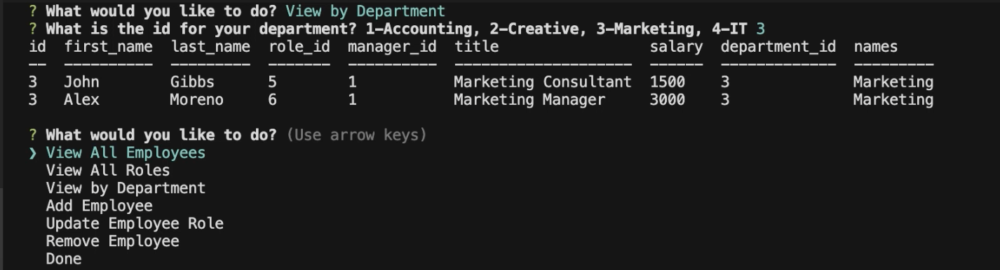

# Employee Database

## Project Description:
Created a Node CLI that creates a database for employees. It includes the first and last names, each department and roles, and salary.

## Installation:
* NPM Inquirer
* Console Table
* mySQL

## Usage:
The person in-charge of creating this employee database would be the one answering the prompts. The user can view all employees, view by department, view by roles, add employees, remove employees and update each employee.

## Contributing:
* NPM Inquirer
* Console Table
* mySQL

## Project Preview:
The application looks like the images below:

